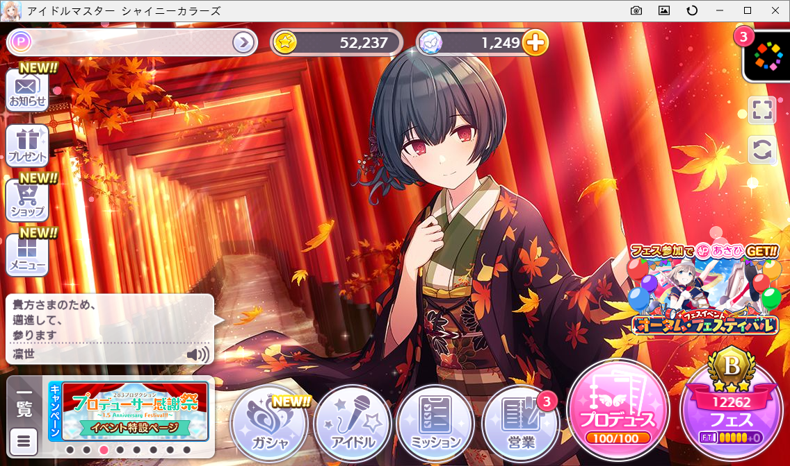

# shinycolors-client
「[アイドルマスター シャイニーカラーズ](https://shinycolors.idolmaster.jp)」非公式クライアント

## 開発環境
* OS : Windows 10 version 1909 64bit
* Node.js : v12.8.0
* Electron : v7.1.9
* pug : v2.0.4
* typescript : v3.7.5

## 免責事項
当コード及びリリースした実行形式ファイルを使用したことで発生したいかなる損害について、作者は一切の責任を負いません。各自、自己責任でお使い下さい。  
また、当ソフトウェアは個人ファンによる非公式ソフトウェアです。  
株式会社バンダイナムコエンターテインメント様、株式会社BXD様、その他の関連会社様とは一切関係ございませんので、そちらへの問い合わせ等はお控えください。  

## License
[MIT License](./LICENSE)

## Special Thanks
[アイドルマスター シャイニーカラーズ](https://shinycolors.idolmaster.jp)  
[panakuma/shinymas-client](https://github.com/panakuma/shinymas-client)  
[shinycolors/shinycwp](https://github.com/shinycolors/shinycwp)  
